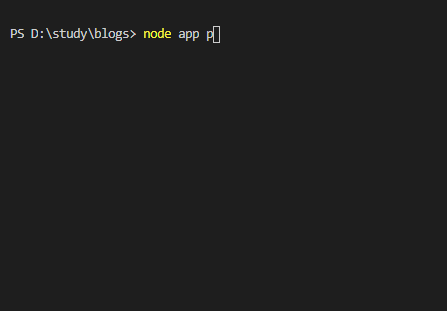
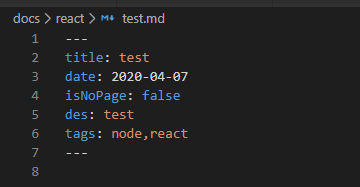

# node写命令行脚本

::: tip 前言
本站博客是用markdown去写文章, 每次去写一片新的文章都是创建目录或者md文件，这一重复过程真的很让人繁琐，今天我就用node作为工具编写命令行脚本。当然这一举动，也成功分说明了node在前端工具链领域还是有很广泛应用价值
:::

需求：执行 node 文件，在控制台输入 文章标题、文章分类、文章简短描述、是否是页面、文件放在哪个目录（已存在和创建）、以及文件名后自动创建 MD 文件。实现的功能如下：




创建的内容如下：



路径则是  <font color=red>xxx/docs/react/test.md</font>

# 前置知识

- [commander](https://github.com/tj/commander.js): 解析用户命令行输入
- [inquirer](https://github.com/SBoudrias/Inquirer.js): 常见的交互式命令行用户界面的集合
- [chalk](https://github.com/chalk/chalk): 美化命令行，进行着色

## commander

[commander](https://github.com/tj/commander.js)灵感来自 Ruby，它提供了用户命令行输入和参数解析的强大功能，可以帮助我们简化命令行开发。 根据其官方的描述，具有以下特性:

- 参数解析
- 强制多态
- 可变参数
- Git 风格的子命令
- 自动化帮助信息
- 自定义帮助等
### example

```js
const program = require('commander')
const inquirer = require('inquirer')
const chalk = require('chalk')
program
  .command('module')
  .alias('m')
  .description('输入名称')
  .option('-n, --name [moduleName]', '模块名称')
  .action(option => {
    console.log('Hello World', option.name)
  })
program.parse(process.argv)
```

```js
$ node app m -n guosw // 输出：Hello World guosw
```

### commander API

- <font color=red>command</font> – 定义命令行指令，后面可跟上一个 name，用空格隔开，如 .command( ‘app [name] ‘)
- <font color=red>alias</font> – 定义一个更短的命令行指令 ，如执行命令\$ app m 与之是等价的
- <font color=red>description</font> – 描述，它会在 help 里面展示
- <font color=red>option</font> – 定义参数。它接受四个参数，在第一个参数中，它可输入短名字 -a 和长名字–app ,使用 | 或者,分隔，在命令行里使用时，这两个是等价的，区别是后者可以在程序里通过回调获取到；第二个为描述, 会在 - - help 信息里展示出来；第三个参数为回调函数，他接收的参数为一个string，有时候我们需要一个命令行创建多个模块，就需要一个回调来处理；第四个参数为默认值
- <font color=red>action</font> – 注册一个 callback 函数,这里需注意目前回调不支持 let 声明变量
- <font color=red>parse</font> – 解析命令行

## inquirer
在开发的过程中，我们需要频繁的跟命令行进行交互，借助 inquirer 这个模块就能轻松实现，它提供了用户界面和查询会话流程。它的语法是这样的（直接从[官方](https://github.com/SBoudrias/Inquirer.js)拷贝~~）

```js
var inquirer = require('inquirer')
inquirer
  .prompt([
    /* Pass your questions in here */
  ])
  .then(function(answers) {
    // Use user feedback for... whatever!!
  })
  ```
### inquirer 功能简介

- <font color=red>input</font> – 输入
- <font color=red>validate</font> – 验证
- <font color=red>list</font> – 列表选项
- <font color=red>confirm</font> – 提示
- <font color=red>checkbox</font> – 复选框等等

### example

```js
inquirer
  .prompt([
    {
      type: 'input',
      name: 'title',
      message: '请输入文章标题',
      validate: function(input) {
        return !input ? '标题不能为空' : true
      }
    }
  ])
  .then(answers => {
    console.log(answers) // { title: 'xxxx' }
  })
```

## 最后本博客实现代码

```js
const program = require('commander') // 解析命令行参数
const inquirer = require('inquirer') // 命令行交互
const fs = require('fs')
const path = require('path')
const chalk = require('chalk') // console.log color
/**
 *对Date的扩展，将 Date 转化为指定格式的String
 *月(M)、日(d)、小时(h)、分(m)、秒(s)、季度(q) 可以用 1-2 个占位符，
 *年(y)可以用 1-4 个占位符，毫秒(S)只能用 1 个占位符(是 1-3 位的数字)
 *例子：
 *(new Date()).Format("yyyy-MM-dd hh:mm:ss.S") ==> 2006-07-02 08:09:04.423
 *(new Date()).Format("yyyy-M-d h:m:s.S")      ==> 2006-7-2 8:9:4.18
 */
Date.prototype.format = function (fmt) {
  var o = {
    "M+": this.getMonth() + 1, //月份
    "d+": this.getDate(), //日
    "h+": this.getHours(), //小时
    "m+": this.getMinutes(), //分
    "s+": this.getSeconds(), //秒
    "q+": Math.floor((this.getMonth() + 3) / 3), //季度
    "S": this.getMilliseconds() //毫秒
  }
  if (/(y+)/.test(fmt)) fmt = fmt.replace(RegExp.$1, (this.getFullYear() + "").substr(4 - RegExp.$1.length))
  for (var k in o)
      if (new RegExp("(" + k + ")").test(fmt)) fmt = fmt.replace(RegExp.$1, (RegExp.$1.length == 1) ? (o[k]) : (("00" + o[k]).substr(("" + o[k]).length)))
  return fmt
}
/**
 * date 日期对象
 * str string
 */
const getTime = (date, str) => date.format(str)
// console.log(getTime(new Date(), 'yyyy-MM-dd'))


// 读取目录文件
const fileList = fs.readdirSync('./docs') // 读取文件目录，里面还包含了文件
// 找出文件夹，过滤 .vuepress 文件
const folderList = fileList.filter(filename => {
  const filePath = path.resolve(__dirname, `./docs/${filename}`)
  // console.log(filePath, 'filePath')
  return filename !== 'images' && filename !== '.vuepress' && fs.statSync(filePath).isDirectory()
})
folderList.unshift('null')

let tags = ["node", "javascript", "sequelize", "vuepress", "css", "git", "mysql", "egg.js", "vue", "es6", "HTML5", "css3", "小程序", "react", "element-ui", "前端", "express", "vue-router"]
let tagsGroup = []
tags.forEach((item, index) => {
  if(index !== 0) {
    tagsGroup.push({
      name: item
    })
  } else {
    tagsGroup.push({
      name: item,
      checked: true
    })
  }
})

program
  .command('page')
  .alias('p')
  .description('脚本命令')
  .option('-a, --name [moduleName]', '模块名称')
  .action(async option => {
    const result = await inquirer.prompt([
      {
        type: 'input',
        name: 'title',
        message: '请输入文章标题',
        validate: function(input) {
          return !input ? '标题不能为空' : true
        }
      },
      {
        type: 'input',
        name: 'des',
        message: '文章简短描述',
        default: ''
      },
      {
        type: 'checkbox',
        name: 'tags',
        message: '请选择文章类别(多选)',
        choices: tagsGroup
      },
      {
        type: 'confirm',
        name: 'isNoPage',
        message: '是否是页面？',
        default: false
      },
      {
        type: 'input',
        name: 'filename',
        message: '请输入文件名',
        validate: function(input) {
          return !input ? '文件名不能为空' : true
        }
      },
      {
        type: 'list',
        name: 'directory',
        message: '请选择文件所在目录',
        choices: folderList
      }
    ])
    // 创建文件
    const { title, tags, filename, isNoPage, des, directory } = result
    // 创建前缀内容
    let prefix = '---\n' + `title: ${title}\n` + `date: ${getTime(new Date(), 'yyyy-MM-dd')}\n` + `isNoPage: ${isNoPage}\n` + `des: ${des}\n` + `tags: ${tags}\n` + '---\n'
    let mid = ''
    if(directory === 'null') {
      const res = await inquirer.prompt({
        type: 'confirm',
        name: 'isNewDirectory',
        message: '是否创建新目录？',
        default: true
      })
      if(res.isNewDirectory) {
        const re = await inquirer.prompt({
          type: 'input',
          name: 'sub',
          message: '请输入文件夹名字',
          validate: function(input) {
            return !input ? '文件夹名字不能为空' : true
          }
        })
        // 创建一个空文件夹
        fs.mkdirSync(`./docs/${re.sub}`)
        mid = `${re.sub}/`
      } else {
        prefix = '---\n' + `isNoPage: ${isNoPage}\n` + `sidebar: ${false}\n` + `editLink: ${false}\n` + `pageClass: ${directory}\n` + '---\n'
      }
    } else {
      mid = `${directory}/`
    }
    const filePath = path.resolve(__dirname, `./docs/${mid}${filename}.md`)
    // 内容写入文件
    fs.writeFileSync(filePath, prefix)
    console.log(chalk.green('create page success: '), filePath)
  })
  program.parse(process.argv)
  ```