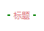
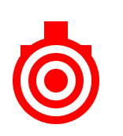
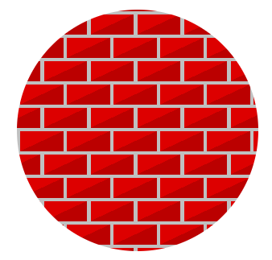
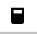

# CSS开发效率的必备片段
> 这篇文章会记录我平时常用到的 CSS 片段，使用这些 CSS 可以帮助我们解决许多实际项目中遇到的问题，方便日后查找。

[[toc]]

### 清除浮动
::: tip 提示
浮动给我们的代码带来的麻烦，想必不需要多说，我们会用很多方式来避免这种麻烦，其中我觉得最方便也是兼容性最好的一种是，在同级目录下再创建一个
```css
<div style="clear:both;"></div>
```
不过这样会增加很多无用的代码。此时我们用:after这个伪元素来解决浮动的问题，如果当前层级有浮动元素，那么在其父级添加上 clearfix 类即可。
:::
```css
// 清除浮动
.clearfix:after {
  content: "\00A0";
  display: block;
  visibility: hidden;
  width: 0;
  height: 0;
  clear: both;
  font-size: 0;
  line-height: 0;
  overflow: hidden;
}
.clearfix {
  zoom: 1;
}
```

### 垂直水平居中
>在 css 的世界里水平居中比垂直居中来的简单一些，经过了多年的演化，依然没有好的方式来让元素垂直居中(各种方式各有优缺点，但都不能达到兼容性好，破坏力小的目标)，以下是几种常见的实现方式

#### 绝对定位方式且已知宽高

```css
.box{
  position: absolute;
  top: 50%;
  left: 50%;
  margin-top: -3em;
  margin-left: -7em;
  width: 14em;
  height: 6em;
}
```

#### 绝对定位 ＋ 未知宽高 ＋ translate
```css
.box{
  position: absolute;
  left: 50%;
  top: 50%;
  //需要补充浏览器前缀, 这里就补充了
  transform: translate(-50%, -50%);
}
```
#### flex 轻松搞定水平垂直居中(未知宽高)
```css
.box{
  display: flex;
  align-items: center;
  justify-content: center;
}
```

### 文本末尾添加省略号
>当文本的内容超出容器的宽度的时候，我们希望在其默认添加省略号以达到提示用户内容省略显示的效果。

#### 宽度固定，适合单行显示...
```css
.box{
  overflow: hidden;
  text-overflow: ellipsis;
  white-space: nowrap;
}
```

#### 宽度不固定，适合多行以及移动端显示
```css
.box{
  overflow: hidden;
  text-overflow: ellipsis;
  display: -webkit-box;
  -webkit-line-clamp: 3;
  -webkit-box-orient: vertical;
}
```

### 制造文本的模糊效果
>当我们希望给文本制造一种模糊效果感觉的时候，可以这样做
```css
.box{
  color: transparent;
  text-shadow: 0 0 2px rgba(0, 0, 0, 0.5);
}
```
### 动画实现简洁 loading 效果
>我们来实现一个非常简洁的 loading 效果
```css
.loading:after {
  display: inline-block;
  overflow: hidden;
  vertical-align: bottom;
  content: "\2026";
  -webkit-animation: ellipsis 2s infinite;
}

// 动画部分
@-webkit-keyframes ellipsis {
  from {
    width: 2px;
  }
  to {
    width: 15px;
  }
}
```

### 自定义文本选中样式
>默认情况下，我们在网页上选中文字的时候，会给选中的部分一个深蓝色背景颜色(可以自己拿起鼠标试试)，如果我们想自己定制被选中的部分的样式呢？
```css
// 注意只能修改这两个属性 字体颜色 选中背景颜色
element::selection {
  color: green;
  background-color: pink;
}
element::-moz-selection {
  color: green;
  background-color: pink;
}
```

### 顶角贴纸效果
>有时候我们会有这样的需求，在一个列表展示页面，有一些列表项是新添加的、或者热度比较高的，就会要求在其上面添加一个贴纸效果的小条就像 hexo 默认博客的 fork me on github 那个效果一样。

```html
<div class="wrap">
  <div class="ribbon">
    <a href="#">Fork me on GitHub</a>
  </div>
</div>
```
```css
/* 外层容器几本设置  */
.wrap {
  width: 160px;
  height: 160px;
  overflow: hidden;
  position: relative;
  background-color: #f3f3f3;
}

.ribbon {
  background-color: #a00;
  overflow: hidden;
  white-space: nowrap;
  position: absolute;
  /* shadom */
  -webkit-box-shadow: 0 0 10px #888;
  -moz-box-shadow: 0 0 10px #888;
  box-shadow: 0 0 10px #888;
  /* rotate */
  -webkit-transform: rotate(-45deg);
  -moz-transform: rotate(-45deg);
  -ms-transform: rotate(-45deg);
  -o-transform: rotate(-45deg);
  transform: rotate(-45deg);
  /* position */
  left: -50px;
  top: 40px;
}

.ribbon a {
  border: 1px solid #faa;
  color: #fff;
  display: block;
  font: bold 81.25% "Helvetica Neue", Helvetica, Arial, sans-serif;
  margin: 1px 0;
  padding: 10px 50px;
  text-align: center;
  text-decoration: none;
  /* shadow */
  text-shadow: 0 0 5px #444;
}
```

### input 占位符
>当我们给部分 input 类型的设置 placeholder 属性的时候，有的时候需要修改其默认的样式。
```css
input::-webkit-input-placeholder {
  color: green;
  background-color: #f9f7f7;
  font-size: 14px;
}
input::-moz-input-placeholder {
  color: green;
  background-color: #f9f7f7;
  font-size: 14px;
}
input::-ms-input-placeholder {
  color: green;
  background-color: #f9f7f7;
  font-size: 14px;
}
```

### 移动端可点击元素去除默认边框
>在移动端浏览器上，当你点击一个链接或者通过 Javascript 定义的可点击元素的时候，会出现蓝色边框，说实话，这是很恶心的，怎么去掉呢?
```css
.box{
  -webkit-tap-highlight-color: rgba(255, 255, 255, 0);
}
```

### 首字下沉
> 要实现类似 word 中首字下沉的效果可以使用以下代码
```css
element:first-letter {
  float: left;
  color: green;
  font-size: 30px;
}
```
### 三角型(实心)
>在很多地方我们可以用得上小三角，接下来我们画一下四个方向的三角形。
```css
.triangle {
  /* 基础样式 */
  border: solid 10px transparent;
  width: 0;
  height: 0;
}
  /*下*/
.triangle.top {
  border-top-color: green;
}
  /*上*/
.triangle.bottom {
  border-bottom-color: green;
}
  /*左*/
.triangle.right {
  border-right-color: green;
}
  /*右*/
.triangle.left {
  border-left-color: green;
}
```
::: tip
可以看出画一个小三角非常简单，只要两行样式就可以搞定，对于方向只要想着画哪个方向则设置反方向的样式属性就可以
:::

### 鼠标手型
> 一般情况下，我们希望在以下元素身上添加鼠标手型
- a
- submit
- input[type="iamge"]
- input[type="button"]
- button
- label
- select
```css
a[href],
input[type="submit"],
input[type="image"],
input[type="button"],
label[for],
select,
button {
  cursor: pointer;
}
```
### 屏蔽 Webkit 移动浏览器中元素高亮效果
> 在访问移动网站时，你会发现，在选中的元素周围会出现一些灰色的框框，使用以下代码屏蔽这种样式
```css
.box{
  -webkit-touch-callout: none;
  -webkit-user-select: none;
  -khtml-user-select: none;
  -moz-user-select: none;
  -ms-user-select: none;
  user-select: none;
}
```

### 移除常用标签的浏览器默认的 margin 和 padding
> pre、code、legend、fieldset、blockquote … 等标签不是很常用，所以就不一一列举，如果项目中使用到，可以自己单独写
```css
body,
p,
h1,
h2,
h3,
h4,
h5,
h6,
dl,
dd,
ul,
ol,
th,
td,
button,
figure,
input,
textarea,
form {
  margin: 0;
  padding: 0;
}
```

### 统一 input、select、textarea 宽度
> 不同浏览器的 input、select、textarea 的盒子模型宽度计算方式不同，统一为最常见的 content-box。
```css
input,
select,
textarea {
  -webkit-box-sizing: content-box;
  -moz-box-sizing: content-box;
  box-sizing: content-box;
}
table {
  /*table 相邻单元格的边框间的距离设置为 0*/
  border-spacing: 0;
  /*默认情况下给 tr 设置 border 没有效果，如果 table 设置了边框为合并模式：「border-collapse: collapse;」就可以了*/
  border-collapse: collapse;
}
```
### 移除浏览器部分元素的默认边框

> acronym、fieldset … 等其他标签不是很常用，就不会一一列举；如果项目中用到，可以自己单独写。
```css
img,
input,
button,
textarea {
  border: none;
  -webkit-appearance: none;
}

input {
  /*由于 input 默认不继承父元素的居中样式，所以设置：「text-align: inherit」*/
  text-align: inherit;
}

textarea {
  /*textarea 默认不可以放缩*/
  resize: none;
}
```
### 取消元素 outline 样式
> 由于以下元素的部分属性没有继承父节点样式，所以声明这些元素的这些属性为父元素的属性。
```css
a,
h1,
h2,
h3,
h4,
h5,
h6,
input,
select,
button,
option,
textarea,
optgroup {
  font-family: inherit;
  font-size: inherit;
  font-weight: inherit;
  font-style: inherit;
  line-height: inherit;
  color: inherit;
  outline: none;
}
```

### 取消超链接元素的默认文字装饰
> 另外 del、ins 标签的中划线、下划线还是挺好的，就不去掉
```css
a {
  text-decoration: none;
}

ol,
ul {
  /*开发中 UI 设计的列表都是和原生的样式差太多，所以直接给取消 ol，ul 默认列表样式*/
  list-style: none;
}

button,
input[type="submit"],
input[type="button"] {
  /*鼠标经过是「小手」形状表示可点击*/
  cursor: pointer;
}

input::-moz-focus-inner {
  /*取消火狐浏览器部分版本 input 聚焦时默认的「padding、border」*/
  padding: 0;
  border: 0;
}
```
### 取消部分浏览器数字输入控件的操作按钮
```css
input[type="number"] {
  -moz-appearance: textfield;
}

input[type="number"]::-webkit-inner-spin-button,
input[type="number"]::-webkit-outer-spin-button {
  margin: 0;
  -webkit-appearance: none;
}
```

### 输入控件 placeholder 色设置 #999
```css
input::-webkit-input-placeholder,
textarea::-webkit-input-placeholder {
  color: #999;
}

input:-moz-placeholder,
textarea:-moz-placeholder {
  color: #999;
}

input::-moz-placeholder,
textarea::-moz-placeholder {
  color: #999;
}

input:-ms-input-placeholder,
textarea:-ms-input-placeholder {
  color: #999;
}

template {
  /*由于部分浏览 template 会显示出来，所以要隐*/
  display: none;
}
```

### position: fixed 的缩写

```css
.pf {
  position: fixed;
  /*chrome 内核 浏览器 position: fixed 防止抖动*/
  -webkit-transform: translateZ(0);
}
```

### 利用绝对定位宽高拉升原理，中心居中元素

```css
.middle {
  position: absolute;
  top: 0;
  right: 0;
  bottom: 0;
  left: 0;
  margin: auto;
}
```

### 利用相对定位于 CSS3 使元素垂直居中

```css
.v-middle {
  position: relative;
  top: 50%;
  -webkit-transform: -webkit-translateY(-50%);
  -moz-transform: -moz-translateY(-50%);
  -o-transform: -o-translateY(-50%);
  transform: translateY(-50%);
}
```

### 元素计算宽高的盒子模型以 border 为外界限「bb ==> border-box」
```css
.bb {
  -webkit-box-sizing: border-box;
  -moz-box-sizing: border-box;
  box-sizing: border-box;
}
```

### 初始化样式
> 不同的浏览器对各个标签默认的样式是不一样的，而且有时候我们也不想使用浏览器给出的默认样式，我们就可以用 reset.css 去掉其默认样式
```css
body,
h1,
h2,
h3,
h4,
h5,
h6,
hr,
p,
blockquote,
dl,
dt,
dd,
ul,
ol,
li,
pre,
form,
fieldset,
legend,
button,
input,
textarea,
th,
td {
  margin: 0;
  padding: 0;
}
body,
button,
input,
select,
textarea {
  font: 12px/1.5 tahoma, arial, \5b8b\4f53;
}
h1,
h2,
h3,
h4,
h5,
h6 {
  font-size: 100%;
}
address,
cite,
dfn,
em,
var {
  font-style: normal;
}
code,
kbd,
pre,
samp {
  font-family: couriernew, courier, monospace;
}
small {
  font-size: 12px;
}
ul,
ol {
  list-style: none;
}
a {
  text-decoration: none;
}
a:hover {
  text-decoration: underline;
}
sup {
  vertical-align: text-top;
}
sub {
  vertical-align: text-bottom;
}
legend {
  color: #000;
}
fieldset,
img {
  border: 0;
}
button,
input,
select,
textarea {
  font-size: 100%;
}
table {
  border-collapse: collapse;
  border-spacing: 0;
}
```

### 强制换行/自动换行/强制不换行

```css
/* 强制不换行 */
div {
  white-space: nowrap;
}

/* 自动换行 */
div {
  word-wrap: break-word;
  word-break: normal;
}

/* 强制英文单词断行 */
div {
  word-break: break-all;
}
```

### table 边界的样式
```css
table {
  border: 1px solid #000;
  padding: 0;
  border-collapse: collapse;
  table-layout: fixed;
  margin-top: 10px;
}
table td {
  height: 30px;
  border: 1px solid #000;
  background: #fff;
  font-size: 15px;
  padding: 3px 3px 3px 8px;
  color: #000;
  width: 160px;
}
```

### line-height
> line-height其实是行高，我们可以用行高来调整布局！不过这个方案有一个比较大的缺点是：文案必须是单行的，多行的话，设置的行高就会有问题。
```css
.container {
  width: 300px;
  height: 200px;
  border: 1px solid #333333;
}
.content {
  line-height: 200px;
}
```

### table 布局
> 给容器元素设置display: table，当前元素设置display: table-cell：
```css
.container {
  width: 300px;
  height: 200px;
  border: 1px solid #333333;
  display: table;
}
.content {
  display: table-cell;
  vertical-align: middle;
  text-align: center;
}
```

### flex 布局
>我们可以给父级元素设置为display: flex，利用 flex 中的align-items和justify-content设置垂直方向和水平方向的居中。这种方式也不限制中间元素的宽度和高度。同时，flex 布局也能替换line-height方案在某些 Android 机型中文字不居中的问题。
```css
.container {
  width: 300px;
  height: 200px;
  border: 1px solid #333333;
  display: flex;
  align-items: center;
  justify-content: center;
}
.content {
  background-color: #ccc;
  text-align: center;
}
```
### 图片上下左右居中
>一种常用的方式是把外层的 div 设置为 table-cell；然后让内部的元素上下左右居中。当然也还有一种方式，就是把 img 当做 div，参考 6 中的代码进行设置。CSS 代码如下：
```css
.content {
  width: 400px;
  height: 400px;
  border: 1px solid #ccc;
  text-align: center;
  display: table-cell;
  vertical-align: middle;
}
```
html代码如下：
```html
<div class="content">
  
</div>
```

### 标题两边的小横杠
>我们经常会遇到这样的 UI 需求，就是标题两边有两个小横岗，之前是怎么实现的呢？比如用个border-top属性，然后再把中间的文字进行绝对定位，同时给这个文字一个背景颜色，把中间的这部分盖住。现在我们可以使用伪元素来实现！


```html
<div class="title">标题</div>
```
```css
title {
  color: #e1767c;
  font-size: 0.3rem;
  position: relative;

  &:before,
  &:after {
    content: "";
    position: absolute;
    display: block;
    left: 50%;
    top: 50%;
    -webkit-transform: translate3d(-50%, -50%, 0);
    transform: translate3d(-50%, -50%, 0);
    border-top: 0.02rem solid #e1767c;
    width: 0.4rem;
  }
  &:before {
    margin-left: -1.2rem;
  }
  &:after {
    margin-left: 1.2rem;
  }
}
```

### 用 border 属性绘制元素
>border 除了作为简单的绘制边框以外，还可以绘制三角形，梯形，星形等任意的多边形，以下为绘制的两个三角形和梯形
```html
<div class="triangle1"></div>
<div class="triangle2"></div>
<div class="trapezoid"></div>
```
```css
.triangle1 {
  /*锐角三角形*/
  width: 0;
  height: 0;
  border-top: 50px solid transparent;
  border-bottom: 100px solid #249ff1;
  border-left: 30px solid transparent;
  border-right: 100px solid transparent;
}
.triangle2 {
  /*直角三角形*/
  width: 0;
  height: 0;
  border-top: 80px solid transparent;
  border-bottom: 80px solid #ff5b01;
  border-left: 50px solid #ff5b01;
  border-right: 50px solid transparent;
}
.trapezoid {
  /*梯形*/
  width: 0;
  height: 0;
  border-top: none;
  border-right: 80px solid transparent;
  border-bottom: 60px solid #13dbed;
  border-left: 80px solid #13dbed;
}
```

### 用 border-radius 绘制元素
> border-radius主要用于绘制圆点、圆形、椭圆、圆角矩形等形状，以下为简单绘制的两个图形。
```html
<div class="circle"></div>
<div class="ellipse"><div></div></div>
```
```css
.circle,
.ellipse {
  width: 100px;
  height: 100px;
  background: #249ff1;
  border-radius: 50%;
}
.ellipse {
  width: 150px;
  background: #ff9e01;
}
```
::: tip
但border-radius属性实际上可以设置最多 8 个值，通过改变 8 个值可以得到许多意想不到的图像, 自己可以尝试一下
:::


### 用 box-shadow 绘制元素
> 对于box-shadow，其完整的声明为box-shadow: h-shadow v-shadow blur spread color inset,各个值表示的意义分别为：s 水平方向的偏移，垂直方向的便宜，模糊的距离（羽化值），阴影的大小（不设置或为 0 时阴影与主体的大小一致），阴影的颜色和是否使用内阴影。实际应用时可以接收 3-6 个值，对应分别如下：
- 3 个值：h-shadow v-shadow color

- 4 个值：h-shadow v-shadow blur color

- 5 个值：h-shadow v-shadow blur spread color

- 6 个值：h-shadow v-shadow blur spread color inset

同时，border-shadow接受由多个以上各种值组成的以逗号分隔的值，通过这一特性，我们可以实现如多重边框的等效果。以下我们用该属性来实现一个单标签且不借助伪元素的添加图标和代表目标的的图标。


```html
<div class="plus"></div>
<div class="target"></div>
```

```css
.plus {
  width: 30px;
  height: 30px;
  margin-left: 50px; /*由于box-shadow不占空间，常常需要添加margin来校正位置*/
  background: #000;
  box-shadow: 0 -30px 0 red, 0 30px 0 red, -30px 0 0 red, 30px 0 0 red;
}
.target {
  width: 30px;
  height: 30px;
  background: red;
  border-radius: 50%;
  margin-left: 50px;
  box-shadow: 0 0 0 10px #fff, 0 0 0 20px red, 0 0 0 30px #fff, 0 0 0 40px red;
}
```

### 使用 CSS 渐变来绘制图标

>CSS3 的渐变属性十分强大，理论上通过渐变可以绘制出任何的图形，渐变的特性和使用足足可以写一篇长文，以下为一个例子



```html
<div class="gradient"></div>
```
```css
.gradient {
  position: relative;
  width: 300px;
  height: 300px;
  border-radius: 50%;
  background-color: silver;
  background-image: linear-gradient(335deg, #b00 23px, transparent 23px),
    linear-gradient(155deg, #d00 23px, transparent 23px), linear-gradient(
      335deg,
      #b00 23px,
      transparent 23px
    ), linear-gradient(155deg, #d00 23px, transparent 23px);
  background-size: 58px 58px;
  background-position: 0px 2px, 4px 35px, 29px 31px, 34px 6px;
}
```
- 杯子

```css
.cup {
  display: inline-block;
  width: 0.9em;
  height: 0.4em;
  border: 0.25em solid;
  border-bottom: 1.1em solid;
  border-radius: 0 0 0.25em 0.25em;
}
.cup:before {
  position: absolute;
  right: -0.6em;
  top: 0;
  width: 0.3em;
  height: 0.8em;
  border: 0.25em solid;
  border-left: none;
  border-radius: 0 0.25em 0.25em 0;
  content: "";
}
```

- 心形
```css
.heart {
  display: inline-block;
  margin-top: 1.5em;
  width: 50px;
  height: 50px;
  background: green;
}
.heart:before,
.heart:after {
  position: absolute;
  width: 1em;
  height: 1.6em;
  background: #000;
  border-radius: 50% 50% 0 0;
  content: "";
  bottom: 0;
}
.heart:before {
  -webkit-transform: rotate(45deg);
  -webkit-transform-origin: 100% 100%;
  right: 0;
  background: red;
  opacity: 0.5;
  z-index: 5;
}
.:after {
  -webkit-transform: rotate(-45deg);
  -webkit-transform-origin: 0 100%;
  left: 0;
  opacity: 0.8;
}
```

- 相机
```css
.camera {
  display: inline-block;
  border-style: solid;
  border-width: 0.65em 0.9em;
  border-radius: 0.1em;
}
.camera:before {
  position: absolute;
  top: -0.3em;
  left: -0.3em;
  width: 0.4em;
  height: 0.4em;
  border-radius: 50%;
  border: 0.1em solid #fff;
  box-shadow: 0 0 0 0.08em, 0 0 0 0.16em #fff;
  content: "";
}
.camera:after {
  position: absolute;
  top: -0.5em;
  left: 0.5em;
  width: 0.2em;
  border-top: 0.125em solid #fff;
  content: "";
}
```
- 月亮
```css
.moon {
  display: inline-block;
  height: 1.5em;
  width: 1.5em;
  box-shadow: inset -0.4em 0 0;
  border-radius: 2em;
  transform: rotate(20deg);
}
```

### 文本缩进
```css

.text-indent {
  text-indent: 2rem;
}
/*16px*/
.text-indent-xs {
  text-indent: 1.5rem;
}
/*12px*/
.text-indent-sm {
  text-indent: 1.7rem;
}
/*14px*/
.text-indent-md {
  text-indent: 2rem;
}
/*18px*/
.text-indent-lg {
  text-indent: 2.4rem;
}
/*20px*/
```

### 分割线预设

```css
hr,
.hr-xs-Silver,
.hr-sm-black,
.hr-sm-Silver,
.hr-xs-gray,
.hr-sm-gray {
  margin: 20px 0;
}
hr {
  border: none;
  border-top: 1px solid #000;
}
.hr-xs-Silver {
  border: none;
  border-top: 1px solid #c0c0c0;
}
.hr-sm-black {
  border: none;
  border-top: 2px solid #000;
}
.hr-sm-Silver {
  border: none;
  border-top: 2px solid #c0c0c0;
}
.hr-xs-gray {
  border: none;
  border-top: 1px solid #767676;
}
.hr-sm-gray {
  border: none;
  border-top: 2px solid #767676;
}
```

### 鼠标 a 标签 hover 效果
```css
.hover-red a:hover,/*为a标签祖先元素添加类名 默认无智能提醒*/ a.hover-red:hover {
  color: red;
} /*单独为a标签添加类名*/
.hover-yellow a:hover,/*为a标签祖先元素添加类名 默认无智能提醒*/ a.hover-yellow:hover {
  color: #ffd700;
} /*单独为a标签添加类名*/
.hover-green a:hover,/*为a标签祖先元素添加类名 默认无智能提醒*/ a.hover-green:hover {
  color: #70aa39;
} /*单独为a标签添加类名*/
.hover-blue a:hover,/*为a标签祖先元素添加类名 默认无智能提醒*/ a.hover-blue:hover {
  color: blue;
} /*单独为a标签添加类名*/
.hover-gray a:hover,/*为a标签祖先元素添加类名 默认无智能提醒*/ a.hover-gray:hover {
  color: #9c9c9c;
} /*单独为a标签添加类名*/
.underline a:hover,
a.underline:hover {
  text-decoration: underline;
}
```

### 阴影效果
```css
.shadow-text-xs {
  text-shadow: 4px 3px 0 #1d9d74, 9px 8px 0 rgba(0, 0, 0, 0.15);
} /*智能兼容ie10以上 暂不考虑*/

.shadow-xs {
  -ms-filter: "progid:DXImageTransform.Microsoft.Shadow(Strength=1, Direction=100, Color='#cccccc')"; /* For IE 8 */
  filter: progid:DXImageTransform.Microsoft.Shadow(Strength=1, Direction=100, Color='#cccccc'); /* For IE 5.5 - 7 */
  -moz-box-shadow: 1px 1px 2px #cccccc; /* for firefox */
  -webkit-box-shadow: 1px 1px 2px #cccccc; /* for safari or chrome */
  box-shadow: 1px 1px 2px #cccccc; /* for opera or ie9 */
}
.shadow-sm {
  -ms-filter: "progid:DXImageTransform.Microsoft.Shadow(Strength=2, Direction=120, Color='#cccccc')"; /* For IE 8 */
  filter: progid:DXImageTransform.Microsoft.Shadow(Strength=2, Direction=120, Color='#cccccc'); /* For IE 5.5 - 7 */
  -moz-box-shadow: 2px 2px 3px #cccccc; /* for firefox */
  -webkit-box-shadow: 2px 2px 3px #cccccc; /* for safari or chrome */
  box-shadow: 2px 2px 3px #cccccc; /* for opera or ie9 */
}
.shadow-md {
  -ms-filter: "progid:DXImageTransform.Microsoft.Shadow(Strength=3, Direction=135, Color='#cccccc')"; /* For IE 8 */
  filter: progid:DXImageTransform.Microsoft.Shadow(Strength=3, Direction=135, Color='#cccccc'); /* For IE 5.5 - 7 */
  -moz-box-shadow: 3px 3px 5px #cccccc; /* for firefox */
  -webkit-box-shadow: 3px 3px 5px #cccccc; /* for safari or chrome */
  box-shadow: 3px 3px 5px #cccccc; /* for opera or ie9 */
}
.shadow-lg {
  -ms-filter: "progid:DXImageTransform.Microsoft.Shadow(Strength=5, Direction=150, Color='#cccccc')"; /* For IE 8 */
  filter: progid:DXImageTransform.Microsoft.Shadow(Strength=5, Direction=150, Color='#cccccc'); /* For IE 5.5 - 7 */
  -moz-box-shadow: 5px 5px 8px #cccccc; /* for firefox */
  -webkit-box-shadow: 5px 5px 8px #cccccc; /* for safari or chrome */
  box-shadow: 5px 5px 8px #cccccc; /* for opera or ie9 */
}
```

### 圆角
```css
.border-radius-xs {
  -webkit-border-radius: 3px;
  -moz-border-radius: 3px;
  border-radius: 3px;
}
.border-radius-sm {
  -webkit-border-radius: 5px;
  -moz-border-radius: 5px;
  border-radius: 5px;
}
.border-radius-md {
  -webkit-border-radius: 7px;
  -moz-border-radius: 5px;
  border-radius: 5px;
}
.border-radius-lg {
  -webkit-border-radius: 9px;
  -moz-border-radius: 9px;
  border-radius: 9px;
}
```