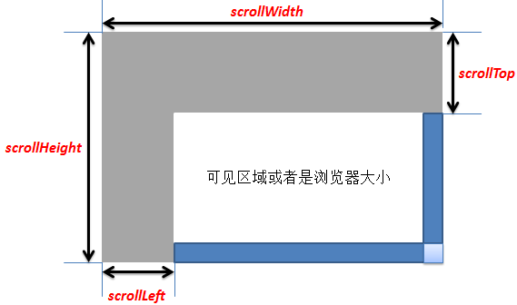

# JavaScript 经典实例收集整理

> 作者：trigkit4 <br/>https://segmentfault.com/a/1190000002559158

[[toc]]

## 跨浏览器添加事件

```js
//跨浏览器添加事件
function addEvent(obj,type,fn){
  if(obj.addEventListener){
    obj.addEventListener(type,fn,false);
  }else if(obj.attachEvent){
    //IE
    obj.attchEvent('on'+type,fn);
  }
}
```

## 跨浏览器移除事件
```js
//跨浏览器移除事件
function removeEvent(obj,type,fn){
  if(obj.removeEventListener){
    obj.removeEventListener(type,fn,false);
  }else if(obj.detachEvent){//兼容IE
    obj.detachEvent('on'+type,fn);
  }
}
```

## 跨浏览器阻止默认行为
```js
//跨浏览器阻止默认行为
function preDef(ev){
  var e = ev || window.event;
  if(e.preventDefault){
    e.preventDefault();
  }else{
    e.returnValue =false;
  }
}
```

## 跨浏览器获取目标对象
```js
//跨浏览器获取目标对象
function getTarget(ev){
    if(ev.target){//w3c
        return ev.target;
    }else if(window.event.srcElement){//IE
        return window.event.srcElement;
    }
}
```
## 跨浏览器获取滚动条位置
```js
//跨浏览器获取滚动条位置，sp == scroll position
function getSP(){
  return{
    top: document.documentElement.scrollTop || document.body.scrollTop,
    left : document.documentElement.scrollLeft || document.body.scrollLeft;
  }
}
```

## 跨浏览器获取可视窗口大小
```js
//跨浏览器获取可视窗口大小
function  getWindow () {
  if(typeof window.innerWidth !='undefined') {
      return{
          width : window.innerWidth,
          height : window.innerHeight
      }

  } else{
      return {
          width : document.documentElement.clientWidth,
          height : document.documentElement.clientHeight
      }
  }
}
```

## js 对象冒充
```js
function Person(name , age){
  this.name = name ;
  this.age = age ;
  this.say = function (){
    return "name : "+ this.name + " age: "+this.age ;
  }
}
var o = new Object() ; // 可以简化为Object()
Person.call(o , "zhangsan" , 20);
console.log(o.say() ); // name : zhangsan age: 20
```


## js 异步加载和同步加载
>异步加载也叫非阻塞模式加载，浏览器在下载js的同时，同时还会执行后续的页面处理。
在script标签内，用js创建一个script元素并插入到document中，这种就是异步加载js文件了：
```js
(function() {
    var s = document.createElement('script');
    s.type = 'text/javascript';
    s.async = true;
    s.src = 'http://yourdomain.com/script.js';
    var x = document.getElementsByTagName('script')[0];
     x.parentNode.insertBefore(s, x);
})();
```

## 同步加载
平常默认用的都是同步加载。如：
```html
<script src="http://yourdomain.com/script.js"></script>
```
同步模式又称阻塞模式，会阻止流览器的后续处理。停止了后续的文件的解析，执行，如图像的渲染。浏览器之所以会采用同步模式，是因为加载的js文件中有对dom的操作，重定向，输出document等默认行为，所以同步才是最安全的。
通常会把要加载的js放到body结束标签之前，使得js可在页面最后加载，尽量减少阻塞页面的渲染。这样可以先让页面显示出来。
同步加载流程是瀑布模型，异步加载流程是并发模型。


## js获取屏幕坐标
```html
<!DOCTYPE html>
<html xmlns="http://www.w3.org/1999/xhtml">
<head>
    <meta http-equiv="Content-Type" content="text/html; charset=gb2312" />
    <meta http-equiv="X-UA-Compatible" content="IE=EmulateIE7"/>
    <meta name="auther" content="fq" />
    <title>获取鼠标坐标</title>
</head>
<body>
<script type="text/javascript">
    function mousePosition(ev){
        if(ev.pageX || ev.pageY){
            return {x:ev.pageX, y:ev.pageY};
        }
        return {
            x:ev.clientX + document.body.scrollLeft - document.body.clientLeft,
            y:ev.clientY + document.body.scrollTop - document.body.clientTop
        };
    }
    function mouseMove(ev){
        ev = ev || window.event;
        var mousePos = mousePosition(ev);
        document.getElementById('xxx').value = mousePos.x;
        document.getElementById('yyy').value = mousePos.y;
    }
    document.onmousemove = mouseMove;
</script>
X:<input id="xxx" type="text" /> Y:<input id="yyy" type="text" />
</body>
</html>
```

::: tip 注意
1. documentElement 属性可返回文档的根节点。
2. scrollTop() 为滚动条向下移动的距离
3. document.documentElement.scrollTop 指的是滚动条的垂直坐标
4. document.documentElement.clientHeight 指的是浏览器可见区域高度
:::

DTD已声明的情况下：
```html
<!DOCTYPE html PUBLIC "-//W3C//DTD XHTML 1.0 Transitional//EN" "http://www.w3.org/TR/xhtml1/DTD/xhtml1-transitional.dtd">
```
如果在页面中添加这行标记的话

**IE**
```js
document.body.clientWidth ==> BODY对象宽度
document.body.clientHeight ==> BODY对象高度
document.documentElement.clientWidth ==> 可见区域宽度
document.documentElement.clientHeight ==> 可见区域高度
```

**Firefox**
```js
document.documentElement.scrollHeight ==> 浏览器所有内容高度
document.body.scrollHeight ==> 浏览器所有内容高度
document.documentElement.scrollTop ==> 浏览器滚动部分高度
document.body.scrollTop ==>始终为0
document.documentElement.clientHeight ==>浏览器可视部分高度
document.body.clientHeight ==> 浏览器所有内容高度
```

**Chrome**
```js
document.documentElement.scrollHeight ==> 浏览器所有内容高度
document.body.scrollHeight ==> 浏览器所有内容高度
document.documentElement.scrollTop==> 始终为0
document.body.scrollTop==>浏览器滚动部分高度
document.documentElement.clientHeight ==> 浏览器可视部分高度
document.body.clientHeight ==> 浏览器所有内容高度
```

<font color=red>浏览器所有内容高度</font>即浏览器整个框架的高度，包括 <font color=red>滚动条卷去部分+可视部分+底部隐藏部分的高度总和</font>
<br/>
<font color=red>浏览器滚动部分高度</font>即滚动条卷去部分高度即可视顶端距离整个对象顶端的高度。

综上
1. document.documentElement.scrollTop和document.body.scrollTop始终有一个为0，所以可以用这两个的和来求scrollTop
2. scrollHeight、clientHeight 在DTD已声明的情况下用documentElement，未声明的情况下用body

::: tip 注意
clientHeight
 在IE和FF下，该属性没什么差别，都是指浏览器的可视区域，即除去浏览器的那些工具栏状态栏剩下的页面展示空间的高度。
:::


## PageX和clientX

1. <font color=red>PageX</font>:鼠标在页面上的位置,从页面左上角开始,即是以页面为参考点,不随滑动条移动而变化
2. <font color=red>clientX</font>:鼠标在页面上可视区域的位置,从浏览器可视区域左上角开始,即是以浏览器滑动条此刻的滑动到的位置为参考点,随滑动条移动 而变化.
3. 可是悲剧的是,PageX只有FF特有,IE则没有这个，所以在IE下使用这个：
4. <font color=red>PageY=clientY+scrollTop-clientTop</font>;(只讨论Y轴,X轴同理,下同)
5. <font color=red>scrollTop</font>代表的是被浏览器滑动条滚过的长度
6. <font color=red>offsetX</font>:IE特有,鼠标相比较于触发事件的元素的位置,以元素盒子模型的内容区域的左上角为参考点,如果有boder`,可能出现负值
7. 只有clientX和screenX 皆大欢喜是W3C标准.其他的,都纠结了.
8. 最给力的是，chrome和safari一条龙通杀!完全支持所有属性



## js拖拽效果

```html
<!doctype html>
<html lang="zn-CN">
<head>
    <meta http-equiv="Content-Type" content="text/html;charset=UTF-8" />
    <title></title>
    <style type="text/css">
        #login{
            height: 100px;
            width: 100px;
            border: 1px solid black;
            position: relative;
            top:200px;
            left: 200px;
            background: red;
        }
</style>
</head>
<body>
<div id="login"></div>
<script type="text/javascript">
    var oDiv = document.getElementById("login");
    oDiv.onmousedown = function(e){
        var e = e || window.event;//window.event兼容IE,当事件发生时有效

        var diffX = e.clientX - oDiv.offsetLeft;//获取鼠标点击的位置到所选对象的边框的水平距离
        var diffY = e.clientY - oDiv.offsetTop;

        document.onmousemove = function(e){ //需设为document对象才能作用于整个文档
            var e = e||window.event;
            oDiv.style.left = e.clientX - diffX + 'px';//style.left表示所选对象的边框到浏览器左侧距离
            oDiv.style.top = e.clientY -diffY + 'px';
        };
        document.onmouseup = function(){
            document.onmousemove = null;//清除鼠标释放时的对象移动方法
            document.onmouseup = null;
        }
    }
</script>
</body> 
</html>
```
::: tip 注意
<font color=red>offsetTop</font> 返回的是数字，而 <font color=red>style.top</font> 返回的是字符串，除了数字外还带有单位：px。
:::


## js获取图片原始大小尺寸

```js
var img = $("#img_id") // Get my img elem
var pic_real_width, pic_real_height
$("&lt;img/&gt;") // Make in memory copy of image to avoid css issues
  .attr("src", $(img).attr("src"))
  .load(function() {
    pic_real_width = this.width   // Note: $(this).width() will not
    pic_real_height = this.height // work for in memory images.
  })
```

### 阻止表单重复提交

有两种方法可以解决：一是提交之后，立刻禁用点击按钮；第二种就是提交之后取消后续的表单提交操作。
```js
document.getElementById("btn").disabled = true;//第一次提交后，将按钮禁用
```
这种方式只能用于通过提交按钮防止重复提交，还可以使用如下方式：
```js
var flag = false;//设置一个监听变量
if(flag ==true)return;//退出事件
flag = true;//表示提交过一次了
```

## 在字符串中查找子字符串

```js
var test = 'Welcome to my blog!';
var value = 'blog';
var subValue = test.indexOf(value);
console.log(subValue);//14,子字符串的索引
```


## Number和Math部分

数字可以是一个直接量，也可以是一个对象，但是Math对象不同，他没有构造函数，并且其所有的属性和方法都是直接通过这个对象来访问的

**把十进制转化为一个十六进制值**

```js
var num = 255;
console.log(num.toString(16));//ff
```
::: tip
js中，十进制数字以0x开头，八进制数字总是以0开头
:::

**随进产生颜色**
```js
function randomVal(val){
  return Math.floor(Math.random()*(val + 1));
}

function randomColor(){
  return 'rgb(' + randomVal(255) + ',' + randomVal(255) + ',' + randomVal(255) + ')';
}
```

::: tip
目前，所有浏览器都支持RGB表示法和十六进制表示法，除了IE7，它只支持十六进制表示法
:::


**在角度和弧度之间转换**

```js
var rad = degrees*(Math.PI/180);
var degrees = rad*(180/Math.PI);

```

## 排序数组

```js
var fruits = ['banana','apple','orange','strawberry'];
console.log(fruits.sort());//Array [ "apple", "banana", "orange", "strawberry" ]
var num = [32,43,2,5,-23,0,4];
console.log(num.sort());//Array [ -23, 0, 2, 32, 4, 43, 5 ]
```

::: tip
Array对象的sort方法会按照字母顺序来排序数组元素。对于数字，是按照字符编码的顺序进行排序
:::

```js
function compare(a,b){
  return a-b;
}
var num = [32,43,2,5,-23,0,4];
console.log(num.sort(compare));//Array [ -23, 0, 2, 4, 5, 32, 43 ]
```

## Date日期时间部分

**js计算时间差**

```js
var date1=new Date();  //开始时间，当前时间

var date2=new Date(); //结束时间，需传入时间参数
var date3=date2.getTime()-date1.getTime();  //时间差的毫秒数

//计算出相差天数
var days=Math.floor(date3/(24*3600*1000));

//计算出小时数
var leave1=date3%(24*3600*1000);    //计算天数后剩余的毫秒数
var hours=Math.floor(leave1/(3600*1000));
//计算相差分钟数
var leave2=leave1%(3600*1000);        //计算小时数后剩余的毫秒数
var minutes=Math.floor(leave2/(60*1000));


//计算相差秒数
var leave3=leave2%(60*1000);      //计算分钟数后剩余的毫秒数
var seconds=Math.round(leave3/1000);

console.log(" 相差 "+days+"天 "+hours+"小时 "+minutes+" 分钟"+seconds+" 秒");
```


## 正则部分

**js实现千分位分隔**
```html

<script type="text/javascript">
  function cc(s){
    if(/[^0-9\.]/.test(s)) return "invalid value";
    s=s.replace(/^(\d*)$/,"$1.");
    s=(s+"00").replace(/(\d*\.\d\d)\d*/,"$1");
    s=s.replace(".",",");
    var re=/(\d)(\d{3},)/;
    while(re.test(s))
        s=s.replace(re,"$1,$2");
    s=s.replace(/,(\d\d)$/,".$1");
    return "￥" + s.replace(/^\./,"0.")
  }
</script>
<input onchange="this.value=cc(this.value)" />
```

## js判断传入参数是否为质数

```js
function fn(input) {
  input = parseInt(input,10);
  return isPrime(input) ? 'is prime' : 'not prime';
}

function isPrime(input) {
  if (input < 2) {
    return false;
  } else {
    for (var i = 2; i <= Math.sqrt(input); i++) {
      if (input % i == 0) {
        return false;
      }
    }
  }
  return true;
}
```


## js判断字符串出现最多的字符，并统计次数

```js
//js实现一个函数，来判断一个字符串出现次数最多的字符，并统计这个次数
function countStr(str){
  var obj = {};
  for(var i = 0, l = str.length,k; i < l ;i++){
      k = str.charAt(i);
      if(obj[k]){
          obj[k]++;
      }else{
          obj[k] = 1;
      }
  }
  var m = 0,i=null;
  for(var k in obj){
      if(obj[k] > m){
          m = obj[k];
          i = k;
      }
  }
  return i + ':' + m;
}
```