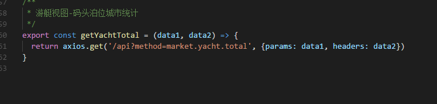

## 浏览器滚动条样式修改（兼容IE）
```css
滚动条样式修改（谷歌等浏览器）
/* 公共的滚动条的样式 */
.scrollBar::-webkit-scrollbar{
  width: 11px;
}
/* 滚动槽 */
.scrollBar::-webkit-scrollbar-track{
  background: #2b3a47;
  width: 3px;
  overflow: hidden;
}
/* 滚动条滑块 */
.scrollBar::-webkit-scrollbar-thumb{
  border-radius: 10px;
  background: #066eb9;
  width: 20px;
}
IE下滚动条样式
.scrollBar{
  /*三角箭头的颜色 （IE下滚动条颜色设置）*/
  scrollbar-arrow-color: #066eb9;
  /*滚动条滑块按钮的颜色*/
  scrollbar-face-color: #066eb9;
  /*滚动条整体颜色*/
  scrollbar-highlight-color: transparent;
  /*滚动条阴影*/
  scrollbar-shadow-color: transparent;
  /*滚动条轨道颜色*/
  scrollbar-track-color: #2b3a47;
}
```
## 三角形样式
```css
div {
  -webkit-transform: translate(-50%, -50%);
  transform: translate(-50%, -50%);
  .tipBox:after{
  position: absolute;
  bottom: -10px;
  width: 0;
  height: 0;
  left: 13%;
  margin-left: -10px;
  content: " ";
  border-top: 10px solid #0d4bae ;
  border-left: 10px solid transparent ;
  border-right: 10px solid transparent ;
}
```
## 渐变色兼容写法（iE）
```css
div {
  background-image: -webkit-gradient(linear, 0 50%, 100% 50%, from(rgba(11, 145, 236, 1)), to(rgba(95, 226, 255, 1)));
  filter: progid:DXImageTransform.Microsoft.gradient(GradientType=1, startColorstr=#0b91ec, endColorstr=#5fe2ff);
  background: -ms-linear-gradient(left,#0b91ec 0%,#5fe2ff 100%);
}
```
## 判断对象中是否有key
```js
obj.hasOwnProperty('value'))
```
## VW解决移动端自适应
[参考文章](https://juejin.im/entry/5aa09c3351882555602077ca)

## git撤销工作区所有修改(没有add和commit)
```js
git checkout .
```
## git使用遇到的问题
> 场景：同事进行版本回退，并且线上也进行版本会退了，我要把我本地版本代码版本同步线上（tips:我的本地版本比线上要超前），可以使用： git reset --hard origin/dev进行版本同步

## Windows下Git多账号配置，同一电脑多个ssh-key的管理
[参考文章](https://www.cnblogs.com/popfisher/p/5731232.html)

## axios发送请求几个技巧
> 
> 
> 

## 时间格式化正则
> YYYY-MM-DD || YYYY/MM/DD
```js
YYYY[(-|/|.)MM][(-|/|.)DD]
```
## moment常用几个方法
```js
// 判断哪个日期在前
moment('2016-05-04').isBefore('2016-05-16')
// 比如指定日期加30天
moment("2019-02-01").add(30,"days").format("YYYY-MM-DD");
// 指定日期减6天
moment().subtract(6, "days").format("YYYY-MM-DD")
// 两个日期相差天数
moment("2019-02-01").diff(moment("2019-01-01"),'days');


// 本周 周日(开始) - 周六(结束)
let start = moment().startOf('week').format('YYYY-MM-DD');
let end = moment().endOf('week').format('YYYY-MM-DD');
// 本周 周一 - 周日
// 从周一开始
moment().startOf('week').add(1, 'day').format('YYYY-MM-DD');
// 从周日结束
moment().endOf('week').add(1, 'day').format('YYYY-MM-DD');
// 本月(开始-结束)
let start = moment().startOf('month').format('YYYY-MM-DD');
let end = moment().endOf('month').format('YYYY-MM-DD');
// 本年(开始-结束)
let start = moment().startOf('year').format('YYYY-MM-DD');
let end = moment().endOf('year').format('YYYY-MM-DD');
```
## npm 几个安装参数理解
```js
npm install packageName //本地安装，安装到项目目录下，不在package.json中写入依赖
npm install packageName -g //全局安装，安装在Node安装目录下的node_modules下
npm install packageName --save //安装到项目目录下，并在package.json文件的dependencies中写入依赖，简写为-S
npm install packageName --save-dev //安装到项目目录下，并在package.json文件的devDependencies中写入依赖，简写为-D
```
## git如何设置不忽略文件夹名字大小写
```js
// 查看本地仓库git忽略大小写是打开还是关闭
git congfig --get core.ignorecase
// 设置false
git config core.ignorecase false
```

## 指定的一个box的子元素的显示顺序
::: warning
  目前没有浏览器支持 box-ordinal-group 属性。
  Firefox 支持替代的 -moz-box-ordinal-group 属性。
  Safari 和 Chrome 支持替代的 -webkit-box-ordinal-group 属性。
:::
```css
  box-ordinal-group: 1(integer) 属性
```
## 如果你还想要存储 untracked files，可以使用 -u 选项。（对于未被git追踪的文件，你如果还想stash, 那么考虑用 -u 选项）
```js
git stash -u
```

## 避免有多次commit提交点
::: tips
可以看到，在执行git commit --amend --no-edit之后，hash值由c56f680变成了eb6c8cb，但是message内容并没有发生变化，并且最重要的是只有一条commit记录。

如果要修改上一条的message，那么去掉--no-edit选项即可，git commit --amend -m "xxxx"。同理，commit记录同样只会有一条。
:::

```js
git commit --amend //命令用来修复最近一次commit. 可以让你合并你缓存区的修改和上一次commit, 而不是提交一个新的快照. 还可以用来编辑上一次的commit描述.
```

