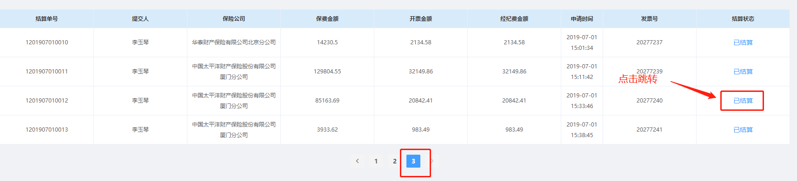
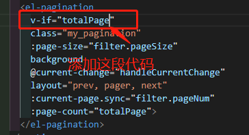

### 关于vue + element-ui项目的分页，返回默认显示第一页的问题解决

> 这个问题是自己开发过程中遇见，防止以后再次出现，所以记录下来。

> 需求描述：在列表页面，点击分页按钮（列如点击到第三页），此时从列表进详情页面，再从详情返回上个列表页面，并且<font color=#FF3030>保持仍旧在第三页</font>

如下截图：

当前页面如下


然后点击页码跳到第3页，然后在第三页点击页面链接跳转到新的页面


然后在新页面点击返回按钮，返回到列表页，结果页面分页显示第一页，对应页面内容也是第一页


### 期望效果

新页面返回的时候，页码和页面内容仍旧保持在跳转离开前的样子。

### 解决办法
#### 利用localStorage或者sessionStorage将跳转页面前的currentPage存储起来，然后，再次返回当前页的时候，在created生命周期里，获取到存储的currentPage，再进行加载（理想很好，现实却很骨感）

```sh
// 跳转详情 存当前页
toDetail (index, row) {
  storage.set('pageNum', this.filter.pageNum)
  this.$router.push({path: '/XXXX', query: {id: row.id, type: row.flowStatus.value}})
}
// 从localstorage取当前页
async mounted () {
  if (storage.get('pageNum')) {
    this.filter.pageNum = storage.get('pageNum')
  }
  // 请求列表数据
  this.getList()
},
```

这样，我们再返回当前页的时候，页面内容将会是跳转离开前的样子。

***但是至此工作仅仅完成一半，因为我们发现这个bug并没有完全解决***
<font color=#FF3030>页面内容正确，页码高亮确认就是第一页</font>

### 问题造成原因
> 我们返回当前页面取得总条数totalNum的之前，element-ui的分页组件已经在页面加载完毕，当时的totalNum绑定的是data里面初始化的数据0，所以当总条数为0的时候，分页组件的页码默认为1。并且当totalNum在created生命周期里取得数据后，分页组件也不会刷新。所以这就导致， ***页面内容正确，但是页码高亮依旧是第一页***

### 解决办法
我们需要在created之后刷新这个分页组件或者让分页组件的html后于created之后加载到页面。
再次刷新这个分页组件是不现实的，我们选择在created之后加载分页组件。具体办法就是使用v-if。在totalNum不为data里面给的初始值0的时候，才让这段html加载到页面。


> 然后再次测试，发现完美解决问题


### 后续：
这里为什么用的是v-if而不是v-show。这就是每个vue初学者需要明白的事情了，就是v-if和v-show的区别。